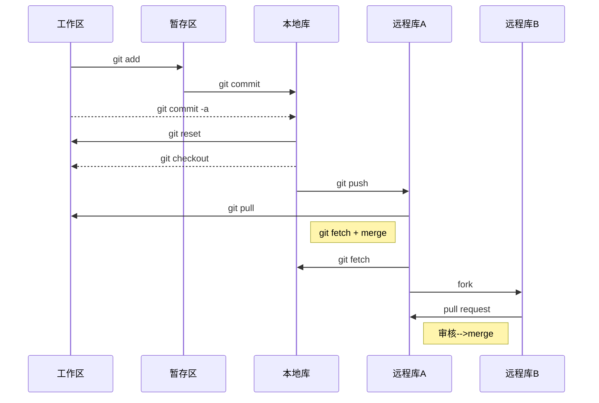

# 标题1
内容1
- 列表
- 列表
# 标题2
## 次标题2
......
## 次标题2

```mermaid
sequenceDiagram
工作区->>暂存区:git add
暂存区->>本地库:git commit

工作区-->> 本地库: git commit -a
本地库 ->> 工作区: git reset
本地库-->>工作区: git checkout
本地库->>远程库A:git push
远程库A->>工作区: git pull
note left of 远程库A:git fetch + merge
远程库A->>本地库: git fetch
远程库A->>远程库B:fork

远程库B->>远程库A:pull request
note right of 远程库A:审核-->merge

```